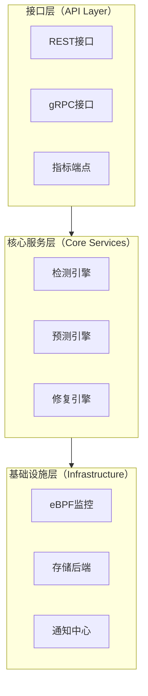

# IOShelfer - 智能I/O系统亚健康检测框架

[](LICENSE)
[](docs/architecture.md)

[English Documentation](README.md) | [架构文档](docs/architecture.md) | [贡献指南](CONTRIBUTING.md)

## 项目简介

IOShelfer 是一个先进的轻量级I/O系统亚健康检测框架，专为企业级基础设施监控而设计。它在关键故障发生之前，为RAID控制器、存储设备和网络I/O子系统提供实时检测、智能预测和自动化修复能力。

## 核心痛点与价值

### 解决的关键痛点
- **静默故障**：传统监控工具往往错过关键故障前的亚健康状态
- **性能劣化**：I/O缓慢导致业务级联影响，缺乏清晰的根因定位
- **人工干预**：缺乏针对亚健康场景的自动化检测和修复能力  
- **可见性不足**：内核级和固件级监控能力不足

### 核心价值主张
- **主动检测**：在关键故障前48小时识别I/O亚健康状态
- **极低性能影响**：基于eBPF的监控，CPU/内存开销<1%
- **智能修复**：AI驱动的预测和自动化隔离策略
- **企业集成**：与现有监控技术栈（Prometheus、Grafana、K8s）无缝集成

## 主要功能特性

### 🔍 多层次亚健康检测
```go
// 示例：RAID控制器队列深度监控
detector := raid.NewControllerDetector(&raid.Config{
    QueueDepthThreshold: 128,
    IOLatencyThreshold:  20 * time.Millisecond,
    MonitorInterval:     5 * time.Second,
})

healthStatus := detector.CheckSubHealth()
if healthStatus.IsSubHealthy() {
    // 自动隔离和修复
    remediation.IsolateController(healthStatus.ControllerID)
}
````

### 📊 实时指标与SLI/SLO管理

```go
// 示例：SLI指标收集
metrics := &sli.Metrics{
    IOLatencyP95:     50 * time.Millisecond,  // 目标: <100ms
    ThroughputLoss:   0.15,                   // 目标: <15%
    ErrorRetryRate:   95,                     // 目标: <100次/小时
}

sloValidator := slo.NewValidator(sli.CriticalBusinessSLO)
violation := sloValidator.Check(metrics)
```

### 🧪 混沌工程集成

```go
// 示例：网络I/O故障注入
experiment := chaos.NewNetworkExperiment(&chaos.NetworkConfig{
    LatencyIncrease: 50 * time.Millisecond,
    PacketLossRate:  0.01, // 1%
    Duration:        30 * time.Minute,
})

// 验证系统韧性
results := experiment.Execute()
```

### ⚡ 基于eBPF的内核监控

* **零代理架构**：无需额外的守护进程
* **内核级可见性**：直接访问I/O队列状态和错误条件
* **亚毫秒级检测**：通过`/proc/iostuck_stats`实时捕获I/O卡慢事件

## 架构概览

IOShelfer采用分层架构设计，确保可扩展性和可维护性：



详细架构信息请参见[架构文档](docs/architecture.md)。

## 快速开始

### 环境要求

* Go 1.20.2 或更高版本
* Linux内核 4.18+（支持eBPF）
* Root权限（用于内核监控）

### 安装部署

```bash
# 克隆仓库
git clone https://github.com/turtacn/ioshelfer.git
cd ioshelfer

# 构建项目
make build

# 使用默认配置运行
sudo ./bin/ioshelfer --config=configs/default.yaml
```

### 基础配置

```yaml
# configs/default.yaml
detection:
  raid:
    enabled: true
    queue_threshold: 128
    latency_threshold: "20ms"
  disk:
    enabled: true
    smart_monitoring: true
    iops_variance_threshold: 0.3
  network:
    enabled: true
    latency_threshold: "50ms"
    packet_loss_threshold: 0.001

remediation:
  auto_isolation: true
  preserve_paths_ratio: 0.5
  min_healthy_paths: 1
```

### 使用示例

#### 1. RAID控制器健康检查

```bash
# 检查RAID控制器亚健康状态
curl -X GET http://localhost:8080/api/v1/raid/controllers/health

# 响应示例
{
  "controllers": [
    {
      "id": "controller-0",
      "status": "subhealthy",
      "queue_depth": 145,
      "avg_latency_ms": 25.3,
      "recommendation": "temporary_isolation"
    }
  ]
}
```

#### 2. 硬盘SMART监控

```bash
# 获取硬盘健康预测
curl -X GET http://localhost:8080/api/v1/disks/predictions

# 响应示例
{
  "predictions": [
    {
      "device": "/dev/sda",
      "health_score": 0.75,
      "predicted_failure_hours": 48,
      "recommendation": "schedule_replacement"
    }
  ]
}
```

## 集成示例

### Prometheus集成

```yaml
# prometheus.yml
scrape_configs:
  - job_name: 'ioshelfer'
    static_configs:
      - targets: ['localhost:8080']
    metrics_path: '/metrics'
    scrape_interval: 30s
```

### Kubernetes部署

```yaml
apiVersion: apps/v1
kind: DaemonSet
metadata:
  name: ioshelfer
spec:
  selector:
    matchLabels:
      app: ioshelfer
  template:
    spec:
      hostNetwork: true
      containers:
      - name: ioshelfer
        image: ioshelfer:latest
        securityContext:
          privileged: true
        volumeMounts:
        - name: proc
          mountPath: /host/proc
          readOnly: true
```

## 性能特征

| 指标    | 目标值    | 典型值    |
| ----- | ------ | ------ |
| 检测延迟  | <100ms | \~50ms |
| CPU开销 | <1%    | \~0.3% |
| 内存开销  | <5%    | \~2%   |
| 误报率   | <5%    | \~1%   |
| 预测准确率 | >90%   | \~95%  |

## 贡献指南

我们欢迎贡献！请查看我们的[贡献指南](CONTRIBUTING.md)了解详情。

### 开发环境设置

```bash
# 安装开发依赖
make dev-setup

# 运行测试
make test

# 运行代码检查
make lint

# 生成文档
make docs
```

## 许可证

本项目采用Apache License 2.0许可证 - 详情请见[LICENSE](LICENSE)文件。

## 社区与支持

* **文档**：[docs/architecture.md](docs/architecture.md)
* **问题反馈**：[GitHub Issues](https://github.com/turtacn/ioshelfer/issues)
* **讨论交流**：[GitHub Discussions](https://github.com/turtacn/ioshelfer/discussions)

---

**用❤️构建可靠的I/O基础设施**