# IOShelfer - Intelligent I/O System Sub-health Detection Framework

[](LICENSE)
[](docs/architecture.md)

[中文文档](README-zh.md) | [Architecture](docs/architecture.md) | [Contributing](CONTRIBUTING.md)

## Overview

IOShelfer is an advanced, lightweight I/O system sub-health detection framework designed for enterprise-grade infrastructure monitoring. It provides real-time detection, intelligent prediction, and automated remediation for RAID controllers, storage devices, and network I/O subsystems before critical failures occur.

## Key Pain Points & Core Value

### Pain Points Addressed
- **Silent Failures**: Traditional monitoring tools often miss sub-health states that precede critical failures
- **Performance Degradation**: I/O slowdowns causing cascading business impacts without clear root cause identification  
- **Manual Intervention**: Lack of automated detection and remediation capabilities for sub-health scenarios
- **Limited Visibility**: Insufficient kernel-level and firmware-level monitoring capabilities

### Core Value Proposition
- **Proactive Detection**: Identify I/O sub-health states 48 hours before critical failures
- **Minimal Performance Impact**: eBPF-based monitoring with <1% CPU/memory overhead
- **Intelligent Remediation**: AI-driven prediction and automated isolation strategies
- **Enterprise Integration**: Seamless integration with existing monitoring stacks (Prometheus, Grafana, K8s)

## Key Features

### 🔍 Multi-layer Sub-health Detection
```go
// Example: RAID Controller Queue Depth Monitoring
detector := raid.NewControllerDetector(&raid.Config{
    QueueDepthThreshold: 128,
    IOLatencyThreshold:  20 * time.Millisecond,
    MonitorInterval:     5 * time.Second,
})

healthStatus := detector.CheckSubHealth()
if healthStatus.IsSubHealthy() {
    // Automatic isolation and remediation
    remediation.IsolateController(healthStatus.ControllerID)
}
````

### 📊 Real-time Metrics & SLI/SLO Management

```go
// Example: SLI Metrics Collection
metrics := &sli.Metrics{
    IOLatencyP95:     50 * time.Millisecond,  // Target: <100ms
    ThroughputLoss:   0.15,                   // Target: <15%
    ErrorRetryRate:   95,                     // Target: <100/hour
}

sloValidator := slo.NewValidator(sli.CriticalBusinessSLO)
violation := sloValidator.Check(metrics)
```

### 🧪 Chaos Engineering Integration

```go
// Example: Network I/O Fault Injection
experiment := chaos.NewNetworkExperiment(&chaos.NetworkConfig{
    LatencyIncrease: 50 * time.Millisecond,
    PacketLossRate:  0.01, // 1%
    Duration:        30 * time.Minute,
})

// Validate system resilience
results := experiment.Execute()
```

### ⚡ eBPF-based Kernel Monitoring

* **Zero-agent Architecture**: No additional daemon processes required
* **Kernel-level Visibility**: Direct access to I/O queue states and error conditions
* **Sub-millisecond Detection**: Real-time capture of I/O stuck events via `/proc/iostuck_stats`

## Architecture Overview

IOShelfer follows a layered architecture designed for scalability and maintainability:

```mermaid
graph TB
    subgraph API[API Layer 接口层]
        REST[REST API] 
        GRPC[gRPC Interface]
        METRICS[Metrics Endpoint]
    end
    
    subgraph CORE[Core Services 核心服务层]
        DETECT[Detection Engine]
        PREDICT[Prediction Engine] 
        REMEDY[Remediation Engine]
    end
    
    subgraph INFRA[Infrastructure Layer 基础设施层]
        EBPF[eBPF Monitoring]
        STORAGE[Storage Backend]
        NOTIFY[Notification Hub]
    end
    
    API --> CORE
    CORE --> INFRA
```



For detailed architecture information, see [Architecture Documentation](docs/architecture.md).

## Quick Start

### Prerequisites

* Go 1.20.2 or higher
* Linux kernel 4.18+ (for eBPF support)
* Root privileges (for kernel monitoring)

### Installation

```bash
# Clone the repository
git clone https://github.com/turtacn/ioshelfer.git
cd ioshelfer

# Build the project
make build

# Run with default configuration
sudo ./bin/ioshelfer --config=configs/default.yaml
```

### Basic Configuration

```yaml
# configs/default.yaml
detection:
  raid:
    enabled: true
    queue_threshold: 128
    latency_threshold: "20ms"
  disk:
    enabled: true
    smart_monitoring: true
    iops_variance_threshold: 0.3
  network:
    enabled: true
    latency_threshold: "50ms"
    packet_loss_threshold: 0.001

remediation:
  auto_isolation: true
  preserve_paths_ratio: 0.5
  min_healthy_paths: 1
```

### Usage Examples

#### 1. RAID Controller Health Check

```bash
# Check RAID controller sub-health status
curl -X GET http://localhost:8080/api/v1/raid/controllers/health

# Response
{
  "controllers": [
    {
      "id": "controller-0",
      "status": "subhealthy",
      "queue_depth": 145,
      "avg_latency_ms": 25.3,
      "recommendation": "temporary_isolation"
    }
  ]
}
```

#### 2. Disk SMART Monitoring

```bash
# Get disk health predictions
curl -X GET http://localhost:8080/api/v1/disks/predictions

# Response
{
  "predictions": [
    {
      "device": "/dev/sda",
      "health_score": 0.75,
      "predicted_failure_hours": 48,
      "recommendation": "schedule_replacement"
    }
  ]
}
```

## Integration Examples

### Prometheus Integration

```yaml
# prometheus.yml
scrape_configs:
  - job_name: 'ioshelfer'
    static_configs:
      - targets: ['localhost:8080']
    metrics_path: '/metrics'
    scrape_interval: 30s
```

### Kubernetes Deployment

```yaml
apiVersion: apps/v1
kind: DaemonSet
metadata:
  name: ioshelfer
spec:
  selector:
    matchLabels:
      app: ioshelfer
  template:
    spec:
      hostNetwork: true
      containers:
      - name: ioshelfer
        image: ioshelfer:latest
        securityContext:
          privileged: true
        volumeMounts:
        - name: proc
          mountPath: /host/proc
          readOnly: true
```

## Performance Characteristics

| Metric              | Target | Typical Value |
| ------------------- | ------ | ------------- |
| Detection Latency   | <100ms | \~50ms        |
| CPU Overhead        | <1%    | \~0.3%        |
| Memory Overhead     | <5%    | \~2%          |
| False Positive Rate | <5%    | \~1%          |
| Prediction Accuracy | >90%   | \~95%         |

## Contributing

We welcome contributions! Please see our [Contributing Guide](CONTRIBUTING.md) for details.

### Development Setup

```bash
# Install development dependencies
make dev-setup

# Run tests
make test

# Run linting
make lint

# Generate documentation
make docs
```

## License

This project is licensed under the Apache License 2.0 - see the [LICENSE](LICENSE) file for details.

## Community & Support

* **Documentation**: [docs/architecture.md](docs/architecture.md)
* **Issues**: [GitHub Issues](https://github.com/turtacn/ioshelfer/issues)
* **Discussions**: [GitHub Discussions](https://github.com/turtacn/ioshelfer/discussions)

---

**Built with ❤️ for reliable I/O infrastructure**