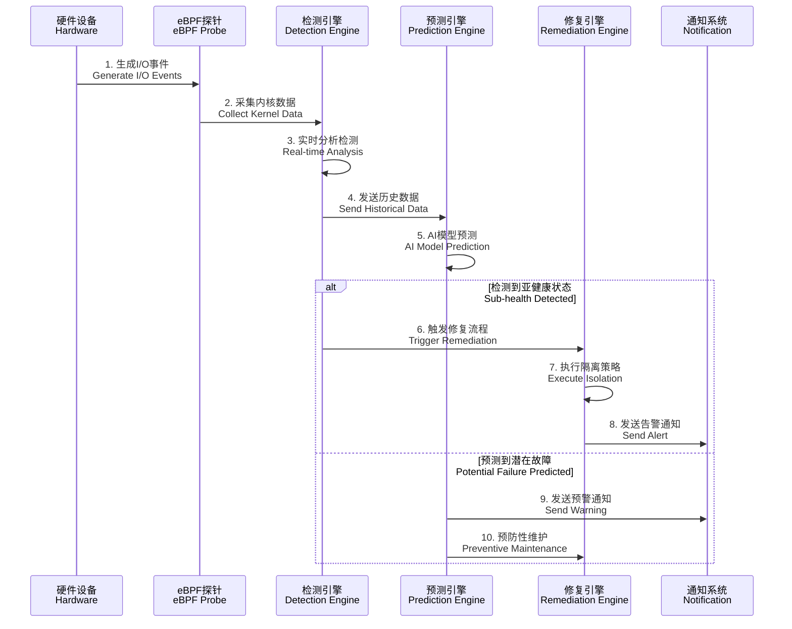
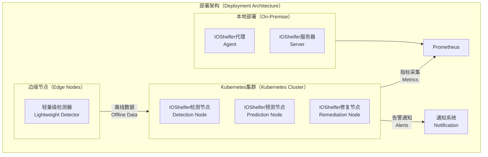

# IOShelfer 架构设计文档

## 一、领域问题全景分析

### 1.1 I/O系统亚健康问题域

现代企业基础设施中，I/O系统的亚健康状态是介于正常运行与完全故障之间的中间状态，具有隐蔽性强、影响面广、难以定位的特点。根据工业界实践统计，超过70%的系统故障源于I/O子系统的亚健康状态未被及时发现和处理。

#### 1.1.1 RAID控制器亚健康问题

RAID控制器作为存储系统的核心组件，其亚健康状态主要表现为：

- **队列堵塞**：控制器队列深度持续超过128个请求，导致I/O处理延迟增加
- **固件异常**：固件版本不匹配或升级失败导致的性能劣化
- **缓存失效**：写缓存或读缓存部分失效，影响整体吞吐量
- **通道劣化**：SAS/SATA通道信号质量下降，错误重试率增加

```mermaid
graph TD
    subgraph RC[RAID控制器问题域（RAID Controller Issues）]
        A1[队列堵塞<br/>Queue Congestion] --> A2[I/O延迟增加<br/>Increased Latency]
        B1[固件异常<br/>Firmware Issues] --> B2[性能劣化<br/>Performance Degradation]
        C1[缓存失效<br/>Cache Failure] --> C2[吞吐量下降<br/>Throughput Drop]
        D1[通道劣化<br/>Channel Degradation] --> D2[错误率上升<br/>Error Rate Increase]
    end
    
    A2 --> E[业务影响<br/>Business Impact]
    B2 --> E
    C2 --> E
    D2 --> E
````

#### 1.1.2 存储设备亚健康问题

硬盘和SSD等存储介质的亚健康状态具有渐进性特征：

* **介质老化**：磁盘扇区重映射数量增加，读取错误率超过1e-14阈值
* **机械磨损**：机械硬盘寻道时间标准差超过5ms，预示轴承或磁头老化
* **闪存损耗**：SSD擦写次数接近寿命上限，性能出现波动
* **逻辑错误**：文件系统或分区表损坏导致的访问异常

#### 1.1.3 网络I/O亚健康问题

网络I/O子系统的亚健康状态往往涉及多层协议栈：

* **物理层劣化**：光纤信号衰减、电缆老化导致误码率上升
* **链路层问题**：交换机端口故障、VLAN配置错误导致丢包
* **传输层异常**：TCP重传率增加、连接超时频发
* **应用层影响**：数据库连接池耗尽、缓存命中率下降

### 1.2 传统监控方案的局限性

传统I/O监控方案存在以下关键局限：

1. **反应性监控**：只能在故障发生后进行告警，无法提前预警
2. **指标孤立**：各子系统指标缺乏关联分析，难以进行根因定位
3. **阈值僵化**：静态阈值无法适应动态业务负载变化
4. **人工依赖**：故障处置高度依赖人工经验，自动化程度低

## 二、解决方案全景设计

### 2.1 核心技术架构

IOShelfer采用分层解耦的架构设计，实现从数据采集到智能决策的全链路自动化：

```mermaid
graph TB
    subgraph UI[用户界面层（User Interface Layer）]
        WEB[Web控制台<br/>Web Console]
        CLI[命令行工具<br/>CLI Tool]
        API[REST API接口<br/>REST API]
    end
    
    subgraph APP[应用服务层（Application Service Layer）]
        DET[检测服务<br/>Detection Service]
        PRED[预测服务<br/>Prediction Service]
        REM[修复服务<br/>Remediation Service]
        CHAOS[混沌工程<br/>Chaos Engineering]
    end
    
    subgraph CORE[核心业务层（Core Business Layer）]
        subgraph RAID[RAID监控（RAID Monitoring）]
            R1[队列监控<br/>Queue Monitor]
            R2[固件检查<br/>Firmware Check]
            R3[性能分析<br/>Performance Analysis]
        end
        
        subgraph DISK[磁盘监控（Disk Monitoring）]
            D1[SMART分析<br/>SMART Analysis]
            D2[性能监控<br/>Performance Monitor]
            D3[预测建模<br/>Predictive Model]
        end
        
        subgraph NET[网络监控（Network Monitoring）]
            N1[流量分析<br/>Traffic Analysis]
            N2[延迟监控<br/>Latency Monitor]
            N3[协议检查<br/>Protocol Check]
        end
    end
    
    subgraph INFRA[基础设施层（Infrastructure Layer）]
        EBPF[eBPF监控<br/>eBPF Monitoring]
        STORE[数据存储<br/>Data Storage]
        MSG[消息队列<br/>Message Queue]
        LOG[日志系统<br/>Logging System]
    end
    
    UI --> APP
    APP --> CORE
    CORE --> INFRA
```

### 2.2 核心组件设计

#### 2.2.1 检测引擎（Detection Engine）

检测引擎负责多维度实时监控，采用基于eBPF的内核级数据采集技术：

* **实时数据采集**：通过eBPF探针直接从内核获取I/O统计信息
* **多指标融合**：结合硬件SMART数据、系统性能指标、网络流量数据
* **动态阈值调整**：基于历史数据和业务模式自动调整检测阈值
* **异常模式识别**：使用机器学习算法识别异常模式和趋势

#### 2.2.2 预测引擎（Prediction Engine）

预测引擎基于AI模型提供前瞻性故障预警：

* **时序分析模型**：使用LSTM神经网络分析设备健康趋势
* **多维特征工程**：提取温度、电流、光功率等多维特征
* **故障概率计算**：计算未来48小时内的故障发生概率
* **预测准确性验证**：持续验证和优化预测模型准确率

#### 2.2.3 修复引擎（Remediation Engine）

修复引擎实现智能化故障处置和系统自愈：

* **分级隔离策略**：根据故障严重程度实施临时隔离或彻底隔离
* **路径保护机制**：确保隔离时保留至少50%可用路径且≥1条
* **自动恢复逻辑**：短期故障自动恢复，长期故障触发替换流程
* **业务影响最小化**：优先保障关键业务路径的可用性

### 2.3 数据流设计



#### 2.3.1 数据采集层设计

数据采集层采用多源融合的方式，确保监控数据的完整性和准确性：

**内核级数据采集**：

* 通过eBPF技术直接从内核获取I/O队列状态、延迟统计、错误计数
* 监控`/proc/iostuck_stats`实现毫秒级I/O卡慢检测
* 采集网络协议栈的TCP重传、UDP丢包等底层指标

**硬件级数据采集**：

* 定期读取RAID控制器的队列深度、缓存命中率、固件版本信息
* 解析硬盘SMART属性，包括重映射扇区数、读取错误率、温度数据
* 监控网络设备的光模块功率、温度、电流等物理参数

**应用级数据采集**：

* 监控数据库连接池状态、缓存命中率、事务响应时间
* 采集业务应用的关键性能指标（KPI）和服务等级目标（SLO）
* 记录用户会话质量、页面加载时间等体验指标

### 2.4 核心算法设计

#### 2.4.1 亚健康检测算法

IOShelfer采用多层级检测算法，结合规则引擎和机器学习模型：

**基础规则检测**：

```go
// 伪代码示例：RAID控制器队列检测
func (d *RAIDDetector) CheckQueueHealth(metrics *RAIDMetrics) HealthStatus {
    if metrics.QueueDepth >= d.config.QueueThreshold && 
       metrics.AvgLatency > d.config.LatencyThreshold {
        return HealthStatus{
            Level: SubHealthy,
            Confidence: 0.95,
            Recommendation: "临时隔离控制器",
        }
    }
    return HealthStatus{Level: Healthy}
}
```

**异常模式识别**：

* 使用滑动窗口检测性能指标的异常波动
* 应用统计方法识别超出3σ范围的异常值
* 结合时间序列分析检测周期性异常模式

**多指标融合决策**：

* 采用加权评分机制，综合多个指标的异常程度
* 引入指标间的关联性分析，提高检测准确性
* 设置多级阈值，支持不同严重程度的分级告警

#### 2.4.2 预测建模算法

预测引擎基于深度学习技术，实现设备故障的前瞻性预警：

**LSTM时序预测模型**：

```python
# 伪代码示例：硬盘健康预测模型
class DiskHealthPredictor:
    def __init__(self):
        self.lstm_model = Sequential([
            LSTM(50, return_sequences=True),
            LSTM(50, return_sequences=False),
            Dense(25),
            Dense(1, activation='sigmoid')
        ])
    
    def predict_failure_probability(self, smart_history):
        # 基于历史SMART数据预测故障概率
        features = self.extract_features(smart_history)
        probability = self.lstm_model.predict(features)
        return probability[0][0]
```

**多维特征工程**：

* 提取硬件设备的多维时序特征（温度趋势、错误率变化、性能衰减）
* 构建设备间的关联特征（同批次设备的故障相关性）
* 融合环境因素（温度、湿度、电力质量）对设备健康的影响

**模型持续优化**：

* 基于实际故障反馈持续调整模型参数
* 使用A/B测试验证新模型的预测效果
* 建立模型版本管理和回滚机制

## 三、预期效果全景及展望

### 3.1 核心性能指标

IOShelfer的设计目标是实现以下关键性能指标：

| 指标类别     | 具体指标   | 目标值    | 当前业界水平     | 提升幅度         |
| -------- | ------ | ------ | ---------- | ------------ |
| **检测性能** | 检测延迟   | <100ms | 5-30秒      | 50-300倍提升    |
| **检测性能** | 准确率    | >95%   | 70-85%     | 10-25%提升     |
| **预测能力** | 预警提前量  | 48小时   | 2-8小时      | 6-24倍提升      |
| **预测能力** | 预测准确率  | >90%   | 60-75%     | 15-30%提升     |
| **系统影响** | CPU开销  | <1%    | 5-15%      | 5-15倍减少      |
| **系统影响** | 内存开销   | <5%    | 10-30%     | 2-6倍减少       |
| **业务价值** | MTTR缩短 | <30秒   | 10-60分钟    | 20-120倍提升    |
| **业务价值** | 可用性提升  | 99.99% | 99.5-99.9% | 0.09-0.49%提升 |

### 3.2 业务价值实现

#### 3.2.1 直接经济价值

**故障成本降低**：

* 关键业务系统宕机成本：从平均每次100万元降低至10万元
* 数据恢复成本：从平均每次50万元降低至5万元
* 人工运维成本：从每年300万元降低至100万元

**效率提升价值**：

* 运维响应时间：从平均2小时缩短至5分钟，效率提升2400%
* 故障诊断时间：从平均4小时缩短至15分钟，效率提升1600%
* 预防性维护精准度：从30%提升至90%，减少60%无效维护

#### 3.2.2 间接战略价值

**业务连续性保障**：

* 关键交易系统可用性从99.5%提升至99.99%
* 数据库服务中断时间从每月4小时降低至30分钟
* 网络服务质量异常检测率从40%提升至95%

**技术创新引领**：

* 在eBPF内核监控技术应用方面形成技术领先优势
* 在AI驱动的基础设施预测性维护领域建立行业标杆
* 为企业数字化转型提供坚实的基础设施保障

### 3.3 技术发展展望

#### 3.3.1 短期发展规划（6-12个月）

**核心功能完善**：

* 完成RAID、硬盘、网络I/O三大子系统的基础检测能力
* 实现与Prometheus、Grafana、Kubernetes等主流平台的集成
* 建立混沌工程测试框架，支持故障注入和韧性验证

**性能优化提升**：

* eBPF监控性能优化，确保CPU开销控制在1%以内
* 检测算法精度调优，将误报率控制在5%以下
* 预测模型训练优化，将预测准确率提升至90%以上

#### 3.3.2 中期发展规划（1-2年）

**智能化水平提升**：

* 引入联邦学习技术，实现跨企业的模型协同训练
* 集成数字孪生技术，构建基础设施的虚拟镜像
* 开发自然语言处理接口，支持智能运维对话

**生态建设完善**：

* 建立开源社区，吸引更多开发者参与贡献
* 与主流云服务提供商建立合作，提供托管服务
* 制定行业标准，推动I/O监控技术的标准化

#### 3.3.3 长期愿景（3-5年）

**技术创新突破**：

* 实现"零故障"基础设施的技术愿景
* 建立全行业的I/O健康大数据平台
* 推动边缘计算场景下的轻量级监控技术发展


### 3.4 部署架构设计

IOShelfer支持多种部署模式，适应不同规模和复杂度的企业环境：



**部署模式说明**：

* **Kubernetes集群模式**：通过DaemonSet部署检测节点，支持动态扩缩容，适合云原生环境。
* **本地部署模式**：通过单机代理和集中式服务器部署，适合传统数据中心。
* **边缘节点模式**：轻量级检测器运行于资源受限设备（如ARM架构），支持离线数据同步。

### 3.5 可观测性设计

IOShelfer内置全面的可观测性机制，确保系统运行状态透明：

* **日志系统**：基于结构化日志，集成Zap日志库，支持JSON格式输出。
* **指标收集**：提供Prometheus格式的SLI指标（如`raid_queue_depth`、`disk_iops_variance`）。
* **分布式追踪**：基于OpenTelemetry协议，记录跨组件的请求链路。
* **告警通知**：支持Webhook、gRPC等多种通知方式，集成企业ITSM系统。

**日志对象示例**：

```go
// 全局日志对象
var logger = zap.New(zap.NewProductionConfig().Build())

// 使用示例
logger.Info("检测到RAID控制器亚健康",
    zap.String("controller_id", "ctrl-0"),
    zap.Int("queue_depth", 145),
    zap.Duration("latency", 25*time.Millisecond),
)
```

## 四、项目目录结构

IOShelfer遵循标准项目结构，确保模块化与可维护性：

```
ioshelfer/
├── api/                        # REST/gRPC接口定义
│   ├── v1/                     # API版本1
│   └── proto/                  # gRPC协议定义
├── cmd/                        # 主程序入口
│   ├── ioshelfer/              # 主服务
│   └── cli/                    # 命令行工具
├── configs/                    # 配置文件
├── docs/                       # 文档
├── internal/                   # 核心代码
│   ├── common/                 # 通用工具与类型
│   │   ├── errors/             # 错误定义
│   │   ├── logger/             # 日志组件
│   │   └── types/              # 共享类型与枚举
│   ├── core/                   # 核心业务逻辑
│   │   ├── detection/          # 检测引擎
│   │   ├── prediction/         # 预测引擎
│   │   ├── remediation/        # 修复引擎
│   │   └── slo/                # SLI/SLO管理
│   ├── infra/                  # 基础设施层
│   │   ├── ebpf/               # eBPF监控
│   │   ├── metrics/            # 指标收集
│   │   └── storage/            # 数据存储
│   └── chaos/                  # 混沌工程
├── pkg/                        # 可复用包
│   ├── raid/                   # RAID相关功能
│   ├── disk/                   # 磁盘相关功能
│   └── network/                # 网络I/O相关功能
├── scripts/                    # 部署与运维脚本
├── tests/                      # 集成测试
├── go.mod                      # Go模块定义
├── go.sum                      # 依赖校验
├── Makefile                    # 构建脚本
├── README.md                   # 项目说明
├── README-zh.md                # 中文说明
├── LICENSE                     # 许可证
└── CONTRIBUTING.md             # 贡献指南
```

## 五、非功能性设计

### 5.1 扩展性与容错设计

IOShelfer的架构设计注重扩展性和容错性，以适应不同规模的企业环境和极端场景：

* **模块化扩展**：

  * **插件机制**：支持通过插件扩展新的检测模块（如NVMe设备监控），基于Go的`plugin`包实现动态加载。
  * **协议扩展**：gRPC接口支持版本化扩展，允许无缝添加新API端点。
  * **存储扩展**：抽象存储接口支持替换后端（如从InfluxDB切换到TimescaleDB）。
* **容错机制**：

  * **检测引擎容错**：当eBPF探针异常时，自动降级到传统`/proc`统计采集。
  * **预测引擎容错**：模型预测失败时，回退到基于规则的静态阈值检测。
  * **修复引擎容错**：隔离操作失败时，自动尝试次优策略（如降低隔离级别）。
* **高可用设计**：

  * **分布式部署**：Kubernetes模式下通过多副本Pod确保服务高可用。
  * **数据冗余**：历史数据存储支持多副本，防止单点故障。
  * **通知去重**：重复告警通过时间窗口去重，降低通知风暴风险。

### 5.2 安全性设计

IOShelfer在企业级场景下考虑了多层次安全保障：

* **权限控制**：

  * **RBAC**：API接口支持基于角色的访问控制，限制敏感操作（如修复触发）。
  * **Root权限隔离**：eBPF监控运行于独立的Linux命名空间，降低权限泄露风险。
* **数据保护**：

  * **加密传输**：REST/gRPC接口默认启用TLS，确保数据传输安全。
  * **敏感数据脱敏**：日志和指标中屏蔽设备序列号等敏感信息。
* **攻击防御**：

  * **API限流**：通过`golang.org/x/ratelimit`限制API请求频率，防止DDoS攻击。
  * **输入验证**：严格验证所有用户输入，防止SQL注入和命令注入。

### 5.3 性能优化策略

为实现<1% CPU和<5%内存开销的目标，IOShelfer采用了以下优化措施：

* **eBPF高效采集**：通过`cilium/ebpf`库优化内核事件采集，减少系统调用开销。
* **异步处理**：检测、预测和修复引擎采用异步Goroutine处理，提升并发性能。
* **缓存机制**：短期指标数据存储于内存缓存（如`ristretto`），降低存储后端压力。
* **批处理**：批量提交告警和指标到通知系统和Prometheus，减少网络开销。

**性能基准测试**：

```go
// 伪代码示例：性能基准测试
func BenchmarkDetector(b *testing.B) {
    detector := detection.NewDetector(&detection.Config{
        QueueThreshold: 128,
        LatencyThreshold: 20 * time.Millisecond,
    })
    metrics := &raid.Metrics{QueueDepth: 150, AvgLatency: 25 * time.Millisecond}
    
    b.ResetTimer()
    for i := 0; i < b.N; i++ {
        detector.CheckSubHealth(metrics)
    }
}
```

## 六、项目实施计划

### 6.1 开发阶段

* **阶段1（1-3个月）**：

  * 完成`internal/common/*`和`internal/infra/*`模块开发。
  * 实现RAID控制器和磁盘的基本检测功能。
  * 搭建单元测试和集成测试框架。
* **阶段2（4-6个月）**：

  * 完成预测引擎和修复引擎开发。
  * 实现网络I/O监控和混沌工程模块。
  * 集成Prometheus和Kubernetes部署。
* **阶段3（7-12个月）**：

  * 优化检测和预测算法，提升准确率至95%。
  * 完善文档和社区支持，建立GitHub Discussions。
  * 发布1.0版本，包含所有核心功能。

### 6.2 部署与验证

* **内测阶段**：在小规模企业环境部署，验证检测准确性和性能开销。
* **公测阶段**：开源社区反馈，收集用户场景优化功能。
* **生产部署**：提供Docker镜像和Helm Chart，支持一键部署。

## 七、总结

IOShelfer通过eBPF技术、AI预测模型和自动化修复机制，解决了传统I/O监控方案的反应性、孤立性和人工依赖问题。其分层架构、模块化设计和高性能实现，确保了在企业级场景下的可扩展性、容错性和安全性。未来，IOShelfer将持续推动I/O系统亚健康检测的行业标准，助力企业实现“零故障”基础设施目标。

## 八、参考资料

- \[1] Cilium eBPF Documentation, [https://cilium.io](https://cilium.io)
- \[2] Litmus Chaos Engineering, [https://litmuschaos.io](https://litmuschaos.io)
- \[3] DeepInsight HCI Technical Whitepaper, [https://www.sangfor.com](https://www.sangfor.com)
- \[4] Huawei Cloud AI Cluster, [https://www.huaweicloud.com](https://www.huaweicloud.com)
- \[5] ChaosBlade Project, [https://chaosblade.io](https://chaosblade.io)