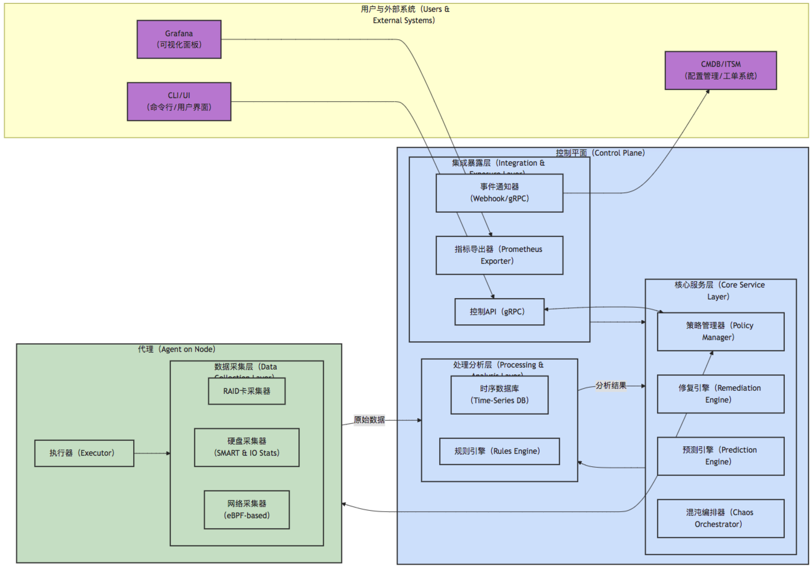
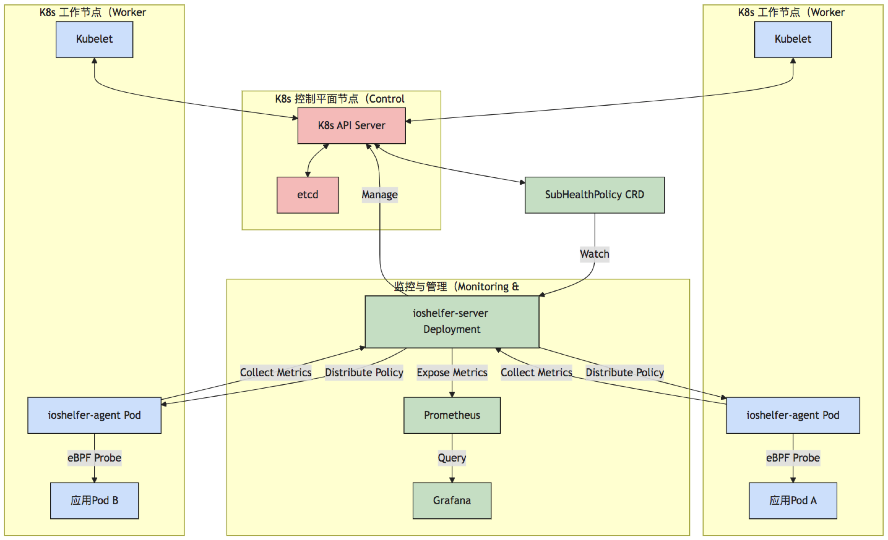

# ioshelfer 架构设计文档

## 1. DFX 全景：I/O 亚健康问题的挑战与机遇

### 1.1. 问题域：沉默的系统杀手

在现代IT基础设施中，I/O 性能是决定应用服务质量（QoS）的关键瓶颈。然而，除了完全的硬件失效（如磁盘损坏、网卡宕机），系统更常面临一种“亚健康”状态。这些状态包括但不限于：

-   **可靠性（DFR - Design for Reliability）挑战**：RAID卡因固件缺陷间歇性重置、SSD因磨损导致读取错误率（UNC）悄然攀升、网络路径因光模块老化出现微小的丢包。这些问题不会立即导致系统崩溃，但会累积风险，最终在业务高峰期触发雪崩效应。
-   **性能（DFP - Design for Performance）挑战**：内核I/O调度队列的瞬时拥堵、NVMe盘的读写延迟出现毛刺、TCP连接因网络微突发导致重传率上升。这些微观性能劣化，传统基于分钟级采样的监控系统极易忽略，但对延迟敏感型业务（如金融交易、实时计算）却是致命的。
-   **可维护性（DFM - Design for Maintainability）挑战**：亚健康问题根因定位极其困难，常常需要跨团队（应用、系统、网络、存储）的专家联合排查，耗时耗力，MTTR（平均修复时间）居高不下。

`ioshelfer` 的核心使命就是解决这些DFX挑战，将不可见的亚健康状态变得**可观测、可预测、可度量、可自动化处置**。

### 1.2. 现有方案格局与启示

深入分析了业界领先的实践，它们为`ioshelfer`的设计提供了宝贵的输入：

-   **硬件与全栈方案（如 华为云）**：这类方案的优势在于软硬件协同，能从固件、驱动层获取最精确的数据，并实现高效的硬件级隔离。它们的启示是：**深入底层是精准检测的关键**。
-   **云原生监控方案（如 Cilium/eBPF）**：这类方案利用 eBPF [1] 技术的革命性能力，实现了内核级的、低开销、无侵入的监控，尤其在网络可观测性方面表现卓越。它们的启示是：**eBPF 是实现轻量化、云原生监控的未来**。
-   **混沌工程与开源工具（如 Litmus、ChaosBlade）**：这些工具强调通过主动注入故障来验证系统的韧性。它们的启示是：**没有经过故障验证的系统，其可靠性承诺是脆弱的**。

### 1.3. ioshelfer 的愿景与定位

`ioshelfer` 并非重复造轮子，而是站在巨人的肩膀上，致力于成为一个**融合、智能、开放**的I/O亚健康治理平台。它将上述方案的优点有机结合，构建一个“**检测-注入-恢复-优化**”的自动化闭环治理体系。

-   **融合**：结合 eBPF 的轻量化监控与传统硬件指标（如 SMART），覆盖从物理层到协议层的全链路。
-   **智能**：引入 AI/ML 模型，从历史数据中学习，实现从“被动响应”到“预测性维护”的跃迁。
-   **开放**：拥抱开源生态，提供标准化的接口（Prometheus, OpenTelemetry），易于集成和扩展，并通过混沌工程不断增强系统自身的免疫力。

## 2. 系统架构设计

### 2.1. 核心设计原则

-   **分层与模块化**：严格遵循高内聚、低耦合的原则，各层、各模块职责单一。
-   **面向接口编程**：核心逻辑依赖于抽象接口而非具体实现，易于扩展和测试。
-   **可观测性优先**：内建统一的日志、指标和追踪机制，任何行为都可被观测。
-   **云原生设计**：以 Kubernetes 为一等公民，采用 Operator 模式进行部署和管理。
-   **安全内建**：在设计之初就考虑认证、授权和数据加密。

### 2.2. 高层体系架构

`ioshelfer` 采用**控制平面（Control Plane）**与**代理（Agent）**分离的架构。Agent 负责在每个节点上进行数据采集和执行本地任务，Control Plane 负责集中分析、策略管理、智能预测和统一暴露。



上图展示了系统的核心组件及其交互关系：
- **用户与外部系统**：通过 `CLI/UI` 管理策略，通过 `Grafana` 查看指标，外部系统如 `CMDB` 通过 `Webhook/gRPC` 接收事件。
- **控制平面（Control Plane）**：是系统的大脑。
    - **集成暴露层**：对外提供 `API`、`Prometheus` 指标和事件通知。
    - **核心服务层**：执行核心业务逻辑，包括策略管理、修复决策、AI预测和混沌实验编排。
    - **处理分析层**：存储和分析从 Agent 收集的数据，内置规则引擎进行实时判断。
- **代理（Agent）**：部署在每个被监控的工作节点上。
    - **数据采集层**：包含多个可插拔的采集器，利用 `eBPF`、`smartctl` 等工具从底层收集数据。
    - **执行器**：负责执行来自控制平面的命令，如运行修复脚本或注入混沌故障。


## 3. 部署架构

### 3.1. Kubernetes 部署模型

在 Kubernetes 环境中，`ioshelfer` 的部署遵循 Operator 模式，以实现自动化生命周期管理。



此部署图要点：
- **ioshelfer-server**：以 `Deployment` 的形式部署，负责集群范围内的管理和分析。它通过 `Watch` 自定义的 `CRD` (例如 `SubHealthPolicy`) 来获取用户意图。
- **ioshelfer-agent**：以 `DaemonSet` 的形式部署，确保每个工作节点上都有一个实例。Agent Pod 具有必要的权限（如 `privileged`）来加载 eBPF 程序和访问宿主机设备。
- **Prometheus/Grafana**：与 `ioshelfer-server` 集成，负责抓取指标和可视化展示。

## 4. 核心工作流（时序图）

### 4.1. 硬盘亚健康检测与自动修复流程

此流程展示了从定义策略到自动修复的完整闭环。

```mermaid
sequenceDiagram
    actor User as 用户
    participant CLI
    participant K8s_API as K8s API Server
    participant Server as ioshelfer-server
    participant Agent as ioshelfer-agent
    participant Notifier as 事件通知器
    
    User ->> CLI: kubectl apply -f policy.yaml
    CLI ->> K8s_API: 创建/更新 SubHealthPolicy CRD
    K8s_API -- CRD Event --> Server: 通知策略变更
    Server ->> Server: 解析策略（目标：disk, 阈值: p95延迟>20ms）
    Server ->> Agent: 分发/更新检测策略
    
    loop 持续检测
        Agent ->> Agent: 通过eBPF探针和smartctl<br>监测硬盘I/O性能和SMART数据
    end

    %% 亚健康状态触发
    Agent ->> Agent: 检测到`/dev/nvme0`的p95延迟<br>连续5分钟超过20ms
    Agent ->> Server: 上报亚健康事件（Event）<br>设备：/dev/nvme0, 规则：HighLatency
    
    Server ->> Server: 收到事件，查询修复策略（临时隔离）
    Server ->> Agent: 下发修复指令（Action: TemporaryIsolate）
    Agent ->> Agent: 执行本地脚本（如：iotool --limit-iops）
    
    Server ->> Notifier: 推送事件至Webhook
    Notifier ->> Notifier: 发送通知到PagerDuty/Slack

```

## 5. 项目目录结构

采用标准的 Golang 项目布局，以实现清晰的关注点分离。

```
ioshelfer/
├── api/
│   └── v1/
│       ├── ioshelfer.proto       # gRPC 服务和消息定义
│       └── ...
├── cmd/
│   ├── ioshelfer-server/
│   │   └── main.go
│   └── ioshelfer-agent/
│       └── main.go
├── configs/
│   ├── server.yaml
│   └── agent.yaml
├── docs/
│   ├── architecture.md
│   └── ...
├── internal/
│   ├── agent/
│   │   ├── collector/              # 采集器实现
│   │   │   ├── disk_collector.go
│   │   │   ├── disk_collector_test.go
│   │   │   ├── network_collector.go
│   │   │   └── raid_collector.go
│   │   ├── executor.go             # 命令执行器
│   │   └── agent.go                # Agent主服务
│   ├── server/
│   │   ├── analysis/               # 分析引擎（规则、预测）
│   │   │   ├── prediction_engine.go
│   │   │   └── rules_engine.go
│   │   ├── remediation/            # 修复引擎
│   │   │   └── remediation_engine.go
│   │   ├── policy/                 # 策略管理器
│   │   │   └── policy_manager.go
│   │   ├── api/                    # API服务实现
│   │   │   └── grpc_server.go
│   │   └── server.go               # Server主服务
│   ├── core/                       # 核心抽象和领域模型
│   │   ├── types.go                # 核心数据结构 (e.g., Event, Metric)
│   │   └── interfaces.go           # 核心接口 (e.g., Collector, Remediator)
│   └── pkg/                        # 项目内部共享的包
│       ├── logger/                 # 日志组件
│       │   └── logger.go
│       ├── errors/                 # 集中错误定义
│       │   └── errors.go
│       └── types/                  # 共享的枚举和常量
│           └── enums.go
├── pkg/                            # 可供外部项目引用的库 (e.g., client library)
│   └── client/
│       └── client.go
├── scripts/
│   ├── setup.sh
│   └── verify.sh
├── test/
│   └── e2e/                        # 端到端测试
├── go.mod
├── go.sum
├── README.md
└── README-zh.md
```

## 6. 参考资料

[1] eBPF & Cilium. (n.d.). eBPF - Introduction, Tutorials & Community. [eBPF.io](https://ebpf.io/).